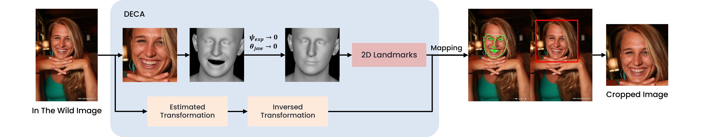
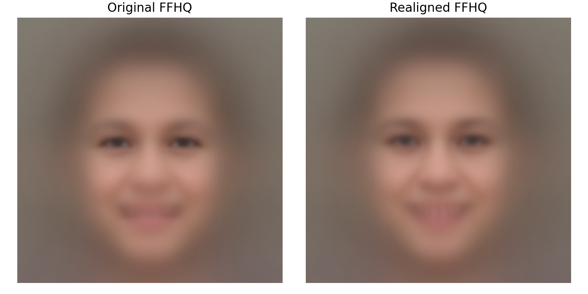
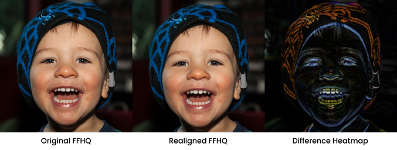
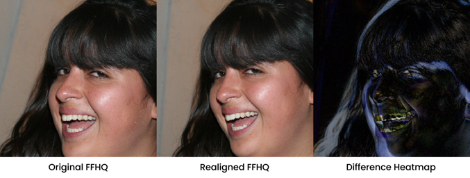

# FFHQ Realign

This repository provides **a preprocessing pipeline for the [FFHQ dataset](https://github.com/NVlabs/ffhq-dataset)**,  
where **face realignment** is applied to improve the consistency of in-the-wild images.  

It is built on top of the [DECA](https://github.com/yfeng95/DECA) framework,  
with the following main modifications:

- `preprocess_ffhq.py`: restructured to function as a **dataset preprocessing script**.  
- `src/face_alignment.py`: a newly added module providing **face alignment utilities**.  

The goal of this project is to **re-estimate bounding boxes and re-crop images based on neutral facial landmarks**,  
producing a more consistent alignment of unconstrained face images.



## Installation

### Build environment

```bash
conda create -n ffhq-realign python=3.9
conda activate ffhq-realign
```

This project uses **PyTorch 2.4.1** (with `torchvision==0.19.1`, `torchaudio==2.4.1`).

Please install the appropriate version for your system (CPU or CUDA) following the [official PyTorch instructions](https://pytorch.org/get-started/previous-versions/).

Example (CUDA 12.1):

```bash
conda install pytorch==2.4.1 torchvision==0.19.1 torchaudio==2.4.1 pytorch-cuda=12.1 -c pytorch -c nvidia
```

Note: If you have a custom CUDA install, you may need to export:

```bash
export CUDA_HOME=/usr/local/cuda-12.1
export PATH=$CUDA_HOME/bin:$PATH
export LD_LIBRARY_PATH=$CUDA_HOME/lib64:$LD_LIBRARY_PATH
```

Install the remaining dependencies:

```bash
pip install -r requirements.txt
```

Additional required packages:

```bash
# Pytorch3D (for 3D-related modules and as fallback rasterizer with --rasterizer_type=pytorch3d)
pip install "git+https://github.com/facebookresearch/pytorch3d.git@stable"
# Chumpy (SMPL / DECA dependencies, works well with Python 3.9)
pip install git+https://github.com/mattloper/chumpy.git
```

## Data Preparation

### 1. Download FFHQ dataset

Please download the official [FFHQ dataset](https://github.com/NVlabs/ffhq-dataset) and organize it as follows:

```bash
ffhq/
├── in-the-wild-images/
└── ffhq-dataset-v2.json
```

If `in-the-wild-images` contains subfolders, flatten them so that all images are directly under `in-the-wild-images/`, then run `prepare_ffhq_json.py`.


### 2. Download FLAME data
Before you continue, you must register at [FLAME](https://flame.is.tue.mpg.de/) and agree to the license.

```bash
mkdir -p ./data

# Enter your FLAME username/password
USERNAME="<your_username>"
PASSWORD="<your_password>"

wget --post-data "username=$USERNAME&password=$PASSWORD" \
  "https://download.is.tue.mpg.de/download.php?domain=flame&sfile=FLAME2020.zip&resume=1" \
  -O ./data/FLAME2020.zip --no-check-certificate --continue

unzip -o ./data/FLAME2020.zip -d ./data/FLAME2020
mv ./data/FLAME2020/generic_model.pkl ./data
```

### 3. Download DECA model
```bash
pip install gdown
gdown 1rp8kdyLPvErw2dTmqtjISRVvQLj6Yzje -O ./data/deca_model.tar
```


## Usage
```bash
python preprocess_ffhq.py --sample_size 1024
``` 

## Results

### Quantitative Analysis

| Metric                               | Original | Preprocessed |
|--------------------------------------|----------|--------------|
| **Scale Consistency** (bbox area ratio std) | 0.0387   | 0.0358       |
| **Landmark Variance** (Mouth)        | 0.0084   | 0.0077       |
| **Landmark Variance** (Jaw)          | 0.0098   | 0.0091       |

### Qualitative Analysis

**Mean Face Comparison**  


**Cropped Samples**  
<p float="left">
  
  
</p>

## License

This repository follows the [DECA License](https://github.com/yfeng95/DECA/tree/master?tab=readme-ov-file#license).


## Acknowledgements

This repo is based on DECA, please cite the original paper if you use this code:
```
@inproceedings{DECA:Siggraph2021,
  title={Learning an Animatable Detailed {3D} Face Model from In-The-Wild Images},
  author={Feng, Yao and Feng, Haiwen and Black, Michael J. and Bolkart, Timo},
  journal = {ACM Transactions on Graphics, (Proc. SIGGRAPH)}, 
  volume = {40}, 
  number = {8}, 
  year = {2021}, 
  url = {https://doi.org/10.1145/3450626.3459936} 
}
```
